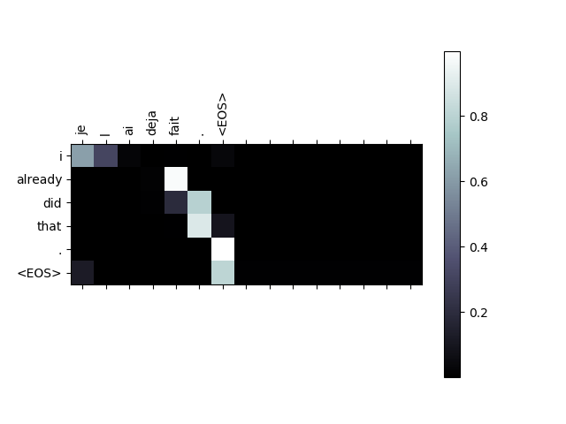
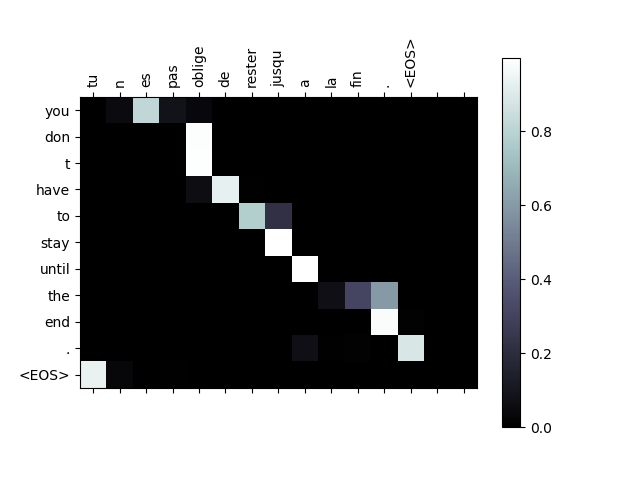
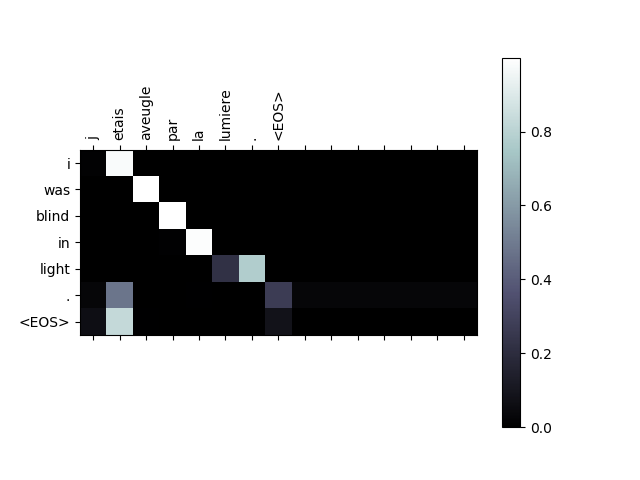
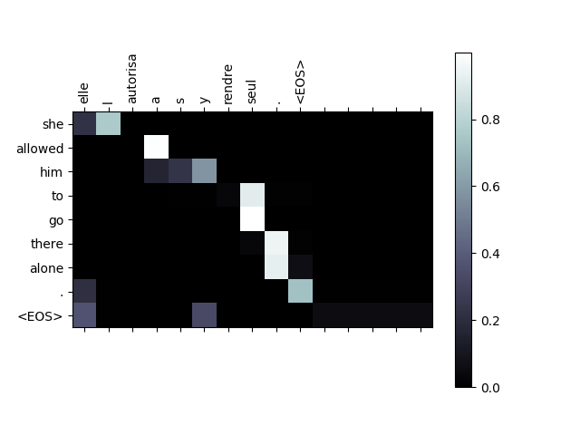
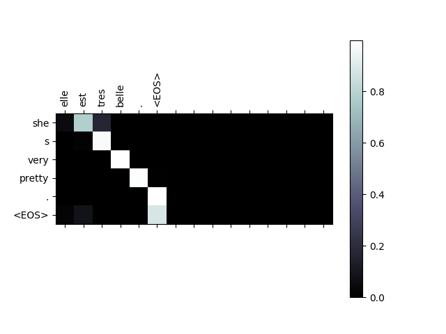

# Neural Machine Translation
This repository provides a simple PyTorch implementation of Neural Machine Translation, along with 
an intrinsic/extrinsic comparison of various sequence-to-sequence (seq2seq) models in translation. 

## Model Overview
As you already know, a Recurrent Neural Network, or RNN, is a network that operates on a sequence and uses its own output as input for subsequent steps.
A seq2seq network(model), or Encoder-Decoder network, is a model consisting of two RNNs called the encoder and decoder. The encoder reads an input sequence and outputs a single vector, and the decoder reads that vector to produce an output sequence.

<p align="left">

</p>

Unlike sequence prediction with a single RNN, where every input corresponds to an output, the seq2seq model frees us from sequence length and order, which makes it ideal for translation between two languages.

Consider a pair of sentences "Je ne suis pas le chat noir" and "I am not the black cat". Most of the words in the input sentence have a direct translation in the output sentence, but are in slightly different orders. Because of the language construction, there is also one more word in the input sentence. It would be difficult to produce a correct translation directly from the sequence of input words.

With a seq2seq model, the encoder creates a single vector which, in the ideal case, encodes the "meaning" of the input sequence into a single vector - a single point in some N dimensional space of sentences.

That is, to find model parameters that maximize the probability of returning target sentence Y by receiving source sentence X. And we can find the model parameters(theta) that maximize P(Y|X,theta) using Maximum Likelihood Estimation(MLE). The formula for seq2seq model is as follows.
<p align="center">

</p>


### Encoder
The encoder of seq2seq network is a RNN that outputs some value for every word from the input sentence. For every input word, the encoder outputs a `(context) vector` and `hidden state`. The last hidden state of the encoder would be a initial hidden state of decoder.

### Decoder
The decoder is another RNN that takes the encoder output vector(s) and outputs a sequence of words to create the translation.

This last output is sometimes called the context vector as it encodes context from the entire sequence. **This context vector is used as the initial hidden state of the decoder**. At every step of decoding, the decoder is given an input token and hidden state. The initial input token is the start of string <SOS> token, and the first hidden state is the context vector (= the encoder's last hidden state). The decoder continues generating words until it outputs an <EOS> token, representing the end of the sentence.

We are also going to use an `Attention Mechanism` in our decoder to help it to pay attention to certain parts of the input when generating the output.

### Auto-regressive and Teacher Forcing
The training method of sequence-to-sequence network is different from the way of inference. The difference between training and inference is fundamentally due to the property **auto-regressive**.

#### Auto-regressive
`Auto-regressive`: infers (or predicts) the present value by reffering to its own values in the past. As shown below, the current time-step output value *y_t* is determined by both the encoder's input sentence (or sequence) *X* and the previous time-step output *(y_1,...y_t-1)*.
<p align="center">

</p>
If our decoder makes false prediction in the past, it can lead to a larger false prediction. (e.g. incorrect sentence structure or length)

#### Teacher Forcing
So we train using a method called Teacher Forcing, which is the concept of using the real target outputs as each next input, instead of using the decoer's guess as the next input.
- `In training mode`, seq2seq network considers that we already know all answers (= the outputs of the last time-step).
- `In inference mode`, seq2seq network takes the input from the output of the last time-step.
<p align="center">

</p>
<p align="center">

</p>

### Attention
If only the context vector is passed between the encoder and decoder, that single vector carries the burden of encoding the entire sentence.
Attention allows the decoder network to "focus" on a different part of the encoder's output for every step of the decoder's own outputs.

First, we calculate a set of attention weights. These will be multiplied by the encoder output vecotrs to create a weighted combination. The result should contain information about that specific part of the input sequence, and thus help the decoder choose the right output words.

Calculating the attention weights is done with a bach matrix-matrix products of matrices stored in the `decoder's output` and `encoder's outpus`. Because there are sentences of all sizes in the training data, to actually create and train this layer, we have to choose a maximum sentence length (input length, for encoder outputs) that it can apply to. Sentences of the maximum length will use all the attention weights, while shorter sentences will only use the first few.

Below image is in [Jay Alammar's blog post](http://jalammar.github.io/visualizing-neural-machine-translation-mechanics-of-seq2seq-models-with-attention/), and well visualize how the attention mechanism enables the decoder to focus on the relevant parts of the input sequence.

[<p align="center"></p>](http://jalammar.github.io/visualizing-neural-machine-translation-mechanics-of-seq2seq-models-with-attention/)  

## Usage

### 1. Preprocessing

The data for this translation task is a set of many thousands of French to English translation pairs. You can see `eng-fra.txt` in the data directory.
To load/normalize text, run the dataLoader script below.

example usage:
```
$ python dataLoader.py
```

If you run the model adopting pre-trained word-embeddings in the `nmt` directory, you should also run the download_fasttext script below.

```
chmod +x download_fasttext.sh
./download_fasttext.sh
```

### 2. Training
```
$ python train.py -h
usage: train.py [-h] --n_iters N_ITERS [--embedding_size EMBEDDING_SIZE]
                [--hidden_size HIDDEN_SIZE]
                [--teacher_forcing_ratio TEACHER_FORCING_RATIO]
                [--n_layers N_LAYERS] [--dropout_p DROPOUT_P]

optional arguments:
  -h, --help            show this help message and exit
  --n_iters N_ITERS     Number of iterations to train
  --embedding_size EMBEDDING_SIZE
                        Word embedding vector dimension size. Default=300
  --hidden_size HIDDEN_SIZE
                        Hidden size of LSTM. Default=600
  --teacher_forcing_ratio TEACHER_FORCING_RATIO
                        Teacher forcing ratio. Default=1
  --n_layers N_LAYERS   Number of layers. Default=2
  --dropout_p DROPOUT_P
                        Dropout ratio. Default=.1
```

example usage:
```
$ python train.py --n_iters 910000 --embedding_size 300 --hidden_size 600 --teacher_forcing_ratio 1 --n_layers 2 --dropout_p .1
```
You may need to change the argument parameters.

### 3. Evaluation
```
$ python evaluate.py -h
usage: evaluate.py [-h] --encoder ENCODER --decoder DECODER
                   [--embedding_size EMBEDDING_SIZE]
                   [--hidden_size HIDDEN_SIZE] [--n_layers N_LAYERS]
                   [--dropout_p DROPOUT_P]
optional arguments:
  -h, --help            show this help message and exit
  --encoder ENCODER     Encoder file path to load trained_encoder's learned
                        parameters.
  --decoder DECODER     Decoder file path to load trained_decoder's learned
                        parameters.
  --embedding_size EMBEDDING_SIZE
                        Word embedding vector dimension size. Default=300
  --hidden_size HIDDEN_SIZE
                        Hidden size of LSTM. Default=600
  --n_layers N_LAYERS   Number of layers. Default=2
  --dropout_p DROPOUT_P
                        Dropout ratio. Default=.1
```

example usage:
```
$ python evaluate.py --encoder trained_model_parameters/encoder-n_layers2-hidden600-tf1-epochs10.pth --decoder trained_model_parameters/decoder-n_layers2-hidden600-tf1-epochs10.pth
```
You may need to change the argument parameters.

## Evaluation

### Evaluation Overview

#### Dataset
- `training-set`
  - 110,621 sentence pairs.
  - Counted words: 20,391 (french), 12,362 (english)
- `test-set`
  - 19,522 sentence pairs.

#### Models
The models were trained with NVIDA Tesla K80, and the number of epochs was 7 (i.e. ~ 10 hours).

- GRU/LSTM: Simple sequence-to-sequence model based on GRU/LSTM Recurrent netwrok, respectively.
- Reverse: Apply Bi-directional LSTM to the encoder part
- Embeddings: Apply Fasttext word embeddings (300D)
- Attention: Apply attention mechanisms to the decoder part

### Extrinsic Evaluation

Below table shows the BLEU from various models in French-English translation task.

cf. Our dataset includes a small amount of sentences that is relatively short(maximum length is 15 words, including ending punctuation),
so it is recommended that the BLEU be considered as a reference only because it is *excssively higher* than the other experiments.

**Baseline Models**

|MODEL|BLEU (train)|BLEU (test)|
|:------|:-----:|:-----:|
|*Baseline* --- GRU|38.01|30.56|
|*Baseline* --- LSTM|53.66|39.30|
|*Baseline* --- Reverse|52.21|38.41|
|*Baseline* --- Reverse + Embeddings|55.35|42.76|

**Advanced Models**

|MODEL|BLEU (train)|BLEU (test)|
|:------|:-----:|:-----:|
|*Ours* --- NMT: Reverse + Embeddings + Attention|65.57|46.70|
|**_Change the number of layers_**||
|*Ours* --- NMT (n_layers=2)|63.85|49.80|
|*Ours* --- NMT (n_layers=3)|61.36|49.09|
|**_Change the hidden size_**||
|*Ours* --- NMT (n_layers=2, hidden_size=600)|69.37|51.37|
|**_Change the teacher forcing ratio_**||
|*Ours* --- NMT (n_layers=2, hidden_size=600, teacher_forcing_ratio=.75)|72.90|54.06|
|*Ours* --- NMT (n_layers=2, hidden_size=600, teacher_forcing_ratio=1)|73.11|53.48|
|*Ours* --- NMT (n_layers=2, hidden_size=600, teacher_forcing_ratio=1, epochs=10)|79.69|55.31|

### Intrinsic Evaluation

Below table shows the results from various models in French-English translation task.

|Target|GRU|LSTM|Reverse|Reverse<br>+Embeddings|NMT|
|------|------|------|------|------|------|
|I have done it already.|I've done it.|I did it already.|I already did it.|I've already done it.|I already did that.|
|You don't have to stay to the end.|You don't have to stay to the end.|You don't have to stay in the end of here.|you don't seem to to stay up.|You don't have to get until the end.|You don't have to stay until the end.|
|I am looking forward to hearing from you soon.|I've turned i ve be heard.|I can't of from from from..|I'm glad to to from from|I can't wait to from your new news.|I look forward to hearing from you.|
|We must be cautious.|We must to be careful.|We must be cautious.|We need to be cautious.|We must to be cautious.|We have to be cautious.|
|I was blinded by the light.|I was careless by the light.|I was out by the light.|I was light on the light.|I was blind in the light.|I was blind in light.|
|I had a weird dream last night.|I had a strange dream last night.|I had a dream dream last night.|I had a weird last night last.|I had a strange dream last night.|I had a strange dream last night.|
|She allowed him to go alone.|She allowed him to go.|She allowed him alone to go alone.|She herself him by herself to go there.|She allowed him to go there by himself.|She allowed him to go there alone.|
|Who sent you?|Who sent you?|Who sent you?|Who sent you??|Who sent you?|Who sent you?|
|The boy remained silent.|The boy remained silent.|The boy remained silent.|The boy went swimming.|The boy remained silent.|The boy stayed silent.|
|She is very beautiful.|She is very beautiful.|She's very beautiful.|She is very beautiful.|She is very beautiful.|She's very pretty.|

### Visualizing Attention

<p align="center">


  









</p>

## Acknowledgment
This work was mainly supported by NEOWIZ AI Research Lab. I would like to thank all the NEOWIZ researchers, especially Sungkyu Oh, for the initial support and feedback.

## References
- [[Loung et al.2015](https://arxiv.org/pdf/1508.04025.pdf)] Effective Approaches to Attention-based Neural Machine Translation
- [[Jay Alammar](http://jalammar.github.io/visualizing-neural-machine-translation-mechanics-of-seq2seq-models-with-attention/)] Visualizing A Neural Machine Translation Model (Mechanics of Seq2seq Models With Attention)
- [[kh-kim/simple-nmt](https://github.com/kh-kim/simple-nmt)] Simple Neural Machine Translation (Simple-NMT)
- [[spro/practical-pytorch](https://github.com/spro/practical-pytorch)] Practical PyTorch
- [[spro/practical-pytorch](https://pytorch.org/tutorials/intermediate/seq2seq_translation_tutorial.html#the-seq2seq-model)] Translation with a Sequence to Sequence Network and Attention

