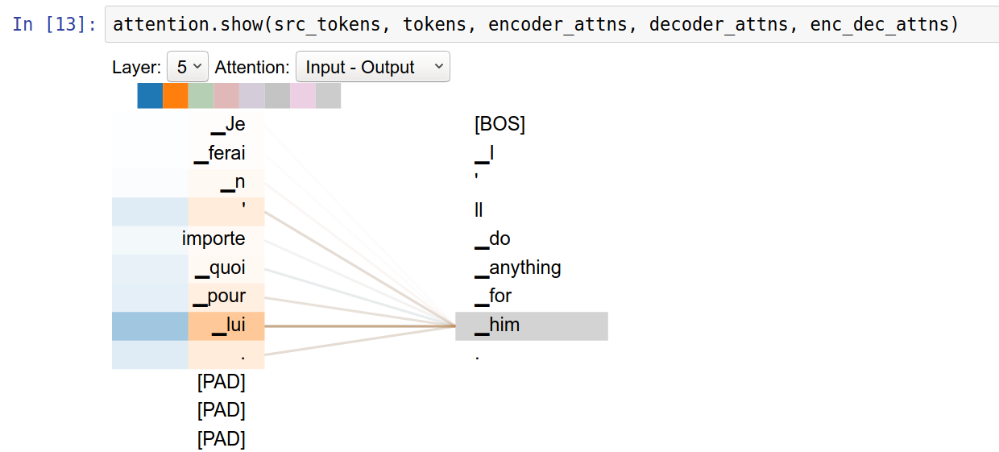
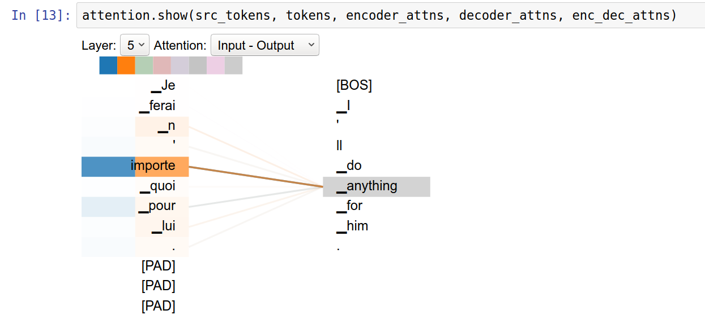

# Neural Machine Translation with Transformer
This neural machine translation tutorial trains a Transformer model on a set of many thousands of French to English translation pairs to translate from French to English.

## Model Overview: Transformer
<p align="center"></p>

The transformer model(based on the paper, _Attention is All You Need_) follows the same general pattern as a standard sequence to sequence with attention model.

The input sentence is passed through N encoder layers that generates an output for each word/token in the sequence. The decoder attends on the encoder's output and its own input (self-attention) to predict the next word.

The transformer model has been proved to be superior in quality for many sequence-to-sequence problems while being more parallelizable.

Here, we will be teaching a transformer to translate from French to English.

### Positional Encoding
Since this model doesn't contain any recurrence or convolution, positional encoding is added to give the model some information about the relative position of the words in the sentence.

The positional encoding vector is added to the embedding vector. Embeddings represent a token in a d-dimensional space where tokens with similar meaning will be closer to each other. But the embeddings do not encode the relative position of words in a sentence. So after adding the positional encoding, words will be closer to each other based on the similarity of their meaning and their position in the sentence, in the d-dimensional space.

The formula for calculating the positional encoding is as follows:
<p align="center"></p>

```python
def get_sinusoid_table(self, seq_len, d_model):
    def get_angle(pos, i, d_model):
        return pos / np.power(10000, (2 * (i//2)) / d_model)
    
    sinusoid_table = np.zeros((seq_len, d_model))
    for pos in range(seq_len):
        for i in range(d_model):
            if i%2 == 0:
                sinusoid_table[pos, i] = np.sin(get_angle(pos, i, d_model))
            else:
                sinusoid_table[pos, i] = np.cos(get_angle(pos, i, d_model))

    return torch.FloatTensor(sinusoid_table)
```

### Encoder
The input sentence is passed through encoder(consists of N encoder layers) that generates an output for each word/token in the sequence.

Each encoder layer consists of two sub-layers:
- Multi-head attention (with padding mask)
- Pointwise feed forward networks

### Multi-Head Attention
<p align="center"></p>
Multi-head attention consists of four parts:

1. Linear layers and split into heads
2. Scaled dot-product attention (with padding mask)
3. Concatenation of heads
4. Final linear layer

#### 1. Linear layers and split into heads
```python
q_heads = self.WQ(Q).view(batch_size, -1, self.n_heads, self.d_k).transpose(1, 2)
k_heads = self.WK(K).view(batch_size, -1, self.n_heads, self.d_k).transpose(1, 2)
v_heads = self.WV(V).view(batch_size, -1, self.n_heads, self.d_v).transpose(1, 2)
# |q_heads| : (batch_size, n_heads, q_len, d_k), |k_heads| : (batch_size, n_heads, k_len, d_k), |v_heads| : (batch_size, n_heads, v_len, d_v)
```

#### 2. Scaled dot-product attention (with padding mask)
```python
class ScaledDotProductAttention(nn.Module):
    def __init__(self, d_k):
        super(ScaledDotProductAttention, self).__init__()
        self.d_k = d_k
    
    def forward(self, q, k, v, attn_mask):
        # |q| : (batch_size, n_heads, q_len, d_k), |k| : (batch_size, n_heads, k_len, d_k), |v| : (batch_size, n_heads, v_len, d_v)
        # |attn_mask| : (batch_size, n_heads, seq_len(=q_len), seq_len(=k_len))
        
        attn_score = torch.matmul(q, k.transpose(-1, -2)) / np.sqrt(self.d_k)
        attn_score.masked_fill_(attn_mask, -1e9)
        # |attn_score| : (batch_size, n_heads, q_len, k_len)

        attn_weights = nn.Softmax(dim=-1)(attn_score)
        # |attn_weights| : (batch_size, n_heads, q_len, k_len)
        
        output = torch.matmul(attn_weights, v)
        # |output| : (batch_size, n_heads, q_len, d_v)
        
        return output, attn_weights
```
```python
attn_mask = attn_mask.unsqueeze(1).repeat(1, self.n_heads, 1, 1)
# |attn_mask| : (batch_size, n_heads, seq_len(=q_len), seq_len(=k_len))
attn, attn_weights = self.scaled_dot_product_attn(q_heads, k_heads, v_heads, attn_mask)
# |attn| : (batch_size, n_heads, q_len, d_v)
# |attn_weights| : (batch_size, n_heads, q_len, k_len)
```

#### 3. Concatenation of heads
```python
attn = attn.transpose(1, 2).contiguous().view(batch_size, -1, self.n_heads * self.d_v)
# |attn| : (batch_size, q_len, n_heads * d_v)
```

#### 4. Final linear layer
```python
output = self.linear(attn)
# |output| : (batch_size, q_len, d_model)
```

You can see full multi-head attention code [here](https://github.com/lyeoni/nlp-tutorial/blob/56aa42908e3a7872a57b653a3db13a6e25366fc4/translation-transformer/model.py#L26).

### Pointwise feed forward networks
<p align="center"></p>
Pointwise feed forward network consists of two fully-connected layers with a ReLU activation in between.

```python
class PositionWiseFeedForwardNetwork(nn.Module):
    def __init__(self, d_model, d_ff):
        super(PositionWiseFeedForwardNetwork, self).__init__()

        self.linear1 = nn.Linear(d_model, d_ff)
        self.linear2 = nn.Linear(d_ff, d_model)
        self.relu = nn.ReLU()

    def forward(self, inputs):
        # |inputs| : (batch_size, seq_len, d_model)

        output = self.relu(self.linear1(inputs))
        # |output| : (batch_size, seq_len, d_ff)
        output = self.linear2(output)
        # |output| : (batch_size, seq_len, d_model)

        return output
```

### Encoder Layer
Each of these sublayers has a residual connection around it followed by a layer normalization. Residual connections help in avoiding the vanishing gradient problem in deep networks.

The output of each sublayer is `LayerNorm(x + Sublayer(x))`. The normalization is done on the d_model (last) axis. There are N encoder layers in the transformer.
```python
class EncoderLayer(nn.Module):
    def __init__(self, d_model, n_heads, p_drop, d_ff):
        super(EncoderLayer, self).__init__()

        self.mha = MultiHeadAttention(d_model, n_heads)
        self.dropout1 = nn.Dropout(p_drop)
        self.layernorm1 = nn.LayerNorm(d_model, eps=1e-6)
        
        self.ffn = PositionWiseFeedForwardNetwork(d_model, d_ff)
        self.dropout2 = nn.Dropout(p_drop)
        self.layernorm2 = nn.LayerNorm(d_model, eps=1e-6)

    def forward(self, inputs, attn_mask):
        # |inputs| : (batch_size, seq_len, d_model)
        # |attn_mask| : (batch_size, seq_len, seq_len)
        
        attn_outputs, attn_weights = self.mha(inputs, inputs, inputs, attn_mask)
        attn_outputs = self.dropout1(attn_outputs)
        attn_outputs = self.layernorm1(inputs + attn_outputs)
        # |attn_outputs| : (batch_size, seq_len, d_model)
        # |attn_weights| : (batch_size, n_heads, q_len(=seq_len), k_len(=seq_len))

        ffn_outputs = self.ffn(attn_outputs)
        ffn_outputs = self.dropout2(ffn_outputs)
        ffn_outputs = self.layernorm2(attn_outputs + ffn_outputs)
        # |ffn_outputs| : (batch_size, seq_len, d_model)
        
        return ffn_outputs, attn_weights
```

### Decoder
The decoder attends on the encoder's output and its own input (self-attention) to predict the next word. 

Each decoder layer consists of sublayers:
- Masked multi-head attention (with look ahead mask and padding mask)
- Multi-head attention (with padding mask). V (value) and K (key) receive the encoder output as inputs. Q (query) receives the output from the masked multi-head attention sublayer.
- Pointwise feed forward networks

### Decoder Layer
```python
class DecoderLayer(nn.Module):
    def __init__(self, d_model, n_heads, p_drop, d_ff):
        super(DecoderLayer, self).__init__()
        
        self.mha1 = MultiHeadAttention(d_model, n_heads)
        self.dropout1 = nn.Dropout(p_drop)
        self.layernorm1 = nn.LayerNorm(d_model, eps=1e-6)

        self.mha2 = MultiHeadAttention(d_model, n_heads)
        self.dropout2 = nn.Dropout(p_drop)
        self.layernorm2 = nn.LayerNorm(d_model, eps=1e-6)

        self.ffn = PositionWiseFeedForwardNetwork(d_model, d_ff)
        self.dropout3 = nn.Dropout(p_drop)
        self.layernorm3 = nn.LayerNorm(d_model, eps=1e-6)
    
    def forward(self, inputs, encoder_outputs, attn_mask, enc_dec_attn_mask):
        # |inputs| : (batch_size, seq_len, d_model)
        # |encoder_outputs| : (batch_size, encoder_outputs_len, d_model)
        # |attn_mask| : (batch_size, seq_len ,seq_len)
        # |enc_dec_attn_mask| : (batch_size, seq_len, encoder_outputs_len)

        attn_outputs, attn_weights = self.mha1(inputs, inputs, inputs, attn_mask)
        attn_outputs = self.dropout1(attn_outputs)
        attn_outputs = self.layernorm1(inputs + attn_outputs)
        # |attn_outputs| : (batch_size, seq_len, d_model)
        # |attn_weights| : (batch_size, n_heads, q_len(=seq_len), k_len(=seq_len))

        enc_dec_attn_outputs, enc_dec_attn_weights = self.mha2(attn_outputs, encoder_outputs, encoder_outputs, enc_dec_attn_mask)
        enc_dec_attn_outputs = self.dropout2(enc_dec_attn_outputs)
        enc_dec_attn_outputs = self.layernorm2(attn_outputs + enc_dec_attn_outputs)
        # |enc_dec_attn_outputs| : (batch_size, seq_len, d_model)
        # |enc_dec_attn_weights| : (batch_size, n_heads, q_len(=seq_len), k_len(=encoder_outputs_len))
        
        ffn_outputs = self.ffn(enc_dec_attn_outputs)
        ffn_outputs = self.dropout3(ffn_outputs)
        ffn_outputs = self.layernorm3(enc_dec_attn_outputs + ffn_outputs)
        # |ffn_outputs| : (batch_size, seq_len, d_model)

        return ffn_outputs, attn_weights, enc_dec_attn_weights
```

You can see detailed code to get look-ahead mask and padding mask [here](https://github.com/lyeoni/nlp-tutorial/blob/56aa42908e3a7872a57b653a3db13a6e25366fc4/translation-transformer/model.py#L209).

## Usage

### 0. Install PreNLP library
PreNLP is Preprocessing Library for Natural Language Processing. It provides sentencepiece tokenizer.
```shell
$ pip install prenlp
```

### 1. Setup input pipeline

#### Donwload paired corpus
The French to English pairs are too big to include in the repo, so download to `data/eng-fra.txt` before continuing. 

```shell
$ curl -O https://download.pytorch.org/tutorial/data.zip
$ sudo apt-get install unzip
$ unzip data.zip
$ ls data
eng-fra.txt  names
```

#### Split paired corpus into eng.txt, fra.txt
```shell
$ cd data
$ awk -F '\t' '{print $1}' eng-fra.txt > eng.txt
$ awk -F '\t' '{print $2}' eng-fra.txt > fra.txt
$ ls
eng-fra.txt  eng.txt  fra.txt  names
```

#### Building vocab based on English/French
Here, use only sentencepiece tokenizer.
```shell
$ cd ..
$ python vocab.py --corpus data/eng.txt --prefix eng --tokenizer sentencepiece --vocab_size 5000
$ python vocab.py --corpus data/fra.txt --prefix fra --tokenizer sentencepiece --vocab_size 5000
```

### 2. Train
#### Using Multi-GPU (recommended)
```shell
$ python main.py --batch_size 256 --multi_gpu 
```
Out:
```
Namespace(batch_size=256, dataset='data/eng-fra.txt', dropout=0.1, epochs=15, ffn_hidden=2048, hidden=512, lr=2, max_seq_len=80, multi_gpu=True, n_attn_heads=8, n_layers=6, no_cuda=False, output_model_prefix='model', pretrained_model_src='fra.model', pretrained_model_tgt='eng.model', vocab_file_src='fra.vocab', vocab_file_tgt='eng.vocab')
Iteration 95 (95/478)   Loss: 6.1785    lr: 9.486832980505139e-05
Iteration 190 (190/478) Loss: 5.0816    lr: 0.00018874844784130018
Iteration 285 (285/478) Loss: 4.4399    lr: 0.0002826285658775489
Iteration 380 (380/478) Loss: 3.9879    lr: 0.00037650868391379767
Iteration 475 (475/478) Loss: 3.6425    lr: 0.0004703888019500465
Train Epoch: 1  >       Loss: 3.6291
Valid Epoch: 1  >       Loss: 2.0696
...
Train Epoch: 13 >       Loss: 0.4851
Valid Epoch: 13 >       Loss: 0.9350
Iteration 95 (95/478)   Loss: 0.3860    lr: 0.0011127057583188288
Iteration 190 (190/478) Loss: 0.4051    lr: 0.0011044230145917963
Iteration 285 (285/478) Loss: 0.4232    lr: 0.0010963225241337866
Iteration 380 (380/478) Loss: 0.4309    lr: 0.0010883976996904363
Iteration 475 (475/478) Loss: 0.4351    lr: 0.0010806422825800639
Train Epoch: 14 >       Loss: 0.4346
Valid Epoch: 14 >       Loss: 0.9324
Iteration 95 (95/478)   Loss: 0.3543    lr: 0.0010728131749874418
Iteration 190 (190/478) Loss: 0.3622    lr: 0.0010653839022710847
Iteration 285 (285/478) Loss: 0.3741    lr: 0.0010581068662670076
Iteration 380 (380/478) Loss: 0.3833    lr: 0.0010509769377496378
Iteration 475 (475/478) Loss: 0.3903    lr: 0.0010439892262204078
Train Epoch: 15 >       Loss: 0.3896
```
#### Using Single GPU
```shell
$ python main.py --batch_size 64
```

You may need to change below argument parameters.
```shell
$ python main.py -h
usage: main.py [-h] [--dataset DATASET] [--vocab_file_src VOCAB_FILE_SRC]
               [--vocab_file_tgt VOCAB_FILE_TGT]
               [--pretrained_model_src PRETRAINED_MODEL_SRC]
               [--pretrained_model_tgt PRETRAINED_MODEL_TGT]
               [--output_model_prefix OUTPUT_MODEL_PREFIX]
               [--batch_size BATCH_SIZE] [--max_seq_len MAX_SEQ_LEN]
               [--epochs EPOCHS] [--lr LR] [--no_cuda] [--multi_gpu]
               [--hidden HIDDEN] [--n_layers N_LAYERS]
               [--n_attn_heads N_ATTN_HEADS] [--dropout DROPOUT]
               [--ffn_hidden FFN_HIDDEN]

optional arguments:
  -h, --help            show this help message and exit
  --dataset DATASET     dataset
  --vocab_file_src VOCAB_FILE_SRC
                        vocabulary path
  --vocab_file_tgt VOCAB_FILE_TGT
                        vocabulary path
  --pretrained_model_src PRETRAINED_MODEL_SRC
                        pretrained sentencepiece model path. used only when
                        tokenizer='sentencepiece'
  --pretrained_model_tgt PRETRAINED_MODEL_TGT
                        pretrained sentencepiece model path. used only when
                        tokenizer='sentencepiece'
  --output_model_prefix OUTPUT_MODEL_PREFIX
                        output model name prefix
  --batch_size BATCH_SIZE
                        batch size
  --max_seq_len MAX_SEQ_LEN
                        the maximum size of the input sequence
  --epochs EPOCHS       the number of epochs
  --lr LR               initial learning rate
  --no_cuda
  --multi_gpu
  --hidden HIDDEN       the number of expected features in the transformer
  --n_layers N_LAYERS   the number of heads in the multi-head attention
                        network
  --n_attn_heads N_ATTN_HEADS
                        the number of multi-head attention heads
  --dropout DROPOUT     the residual dropout value
  --ffn_hidden FFN_HIDDEN
                        the dimension of the feedforward network
```

### 3. Inference
```shell
$ python inference.py --model .model/model.ep15
```
Out:
```shell
tokens: ['▁Je', '▁ferai', '▁n', "'", 'importe', '▁quoi', '▁pour', '▁lui', '.']
src_ids: tensor([[  34, 1746,   25, 4910, 1404,  400,   98,  223, 4906,    0,    0,    0,
            0,    0,    0,    0,    0,    0,    0,    0,    0,    0,    0,    0,
            0,    0,    0,    0,    0,    0,    0,    0,    0,    0,    0,    0,
            0,    0,    0,    0,    0,    0,    0,    0,    0,    0,    0,    0,
            0,    0,    0,    0,    0,    0,    0,    0,    0,    0,    0,    0,
            0,    0,    0,    0,    0,    0,    0,    0,    0,    0,    0,    0,
            0,    0,    0,    0,    0,    0,    0,    0]], device='cuda:0')
tgt_ids: tensor([[2]], device='cuda:0')
--------------------------------------------------------
I'll do anything for him.
```

### Visualizaing Multi-Head Attention
As the transformer decoder translates the word "_him", attention heads are focusing most on "_lui". Actually, "_lui" means "him".
<p align="center"></p>

As the transformer decoder translates the word "_anything", attntion heads are focusing on "_n", " ' ", "importe". Actually, "n'importe" means "anything".
<p align="center"></p>

Be sure to check out the [notebook](assets/attention_visualize.ipynb) where you can visualize attention weights using this interactive visualization.

### References
- [Attention Is All You Need](https://arxiv.org/abs/1706.03762)
- [Sequence-to-Sequence Modeling with nn.Transformer and TorchText](https://pytorch.org/tutorials/beginner/transformer_tutorial.html)
- [Transformer model for language understanding](https://www.tensorflow.org/tutorials/text/transformer?hl=en)
